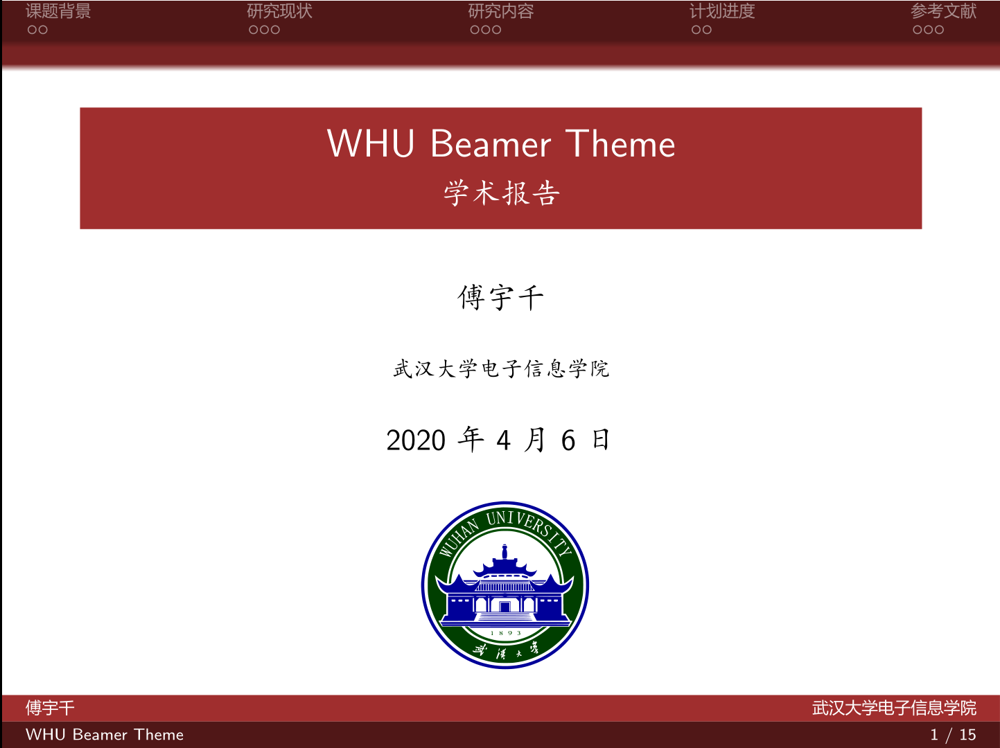
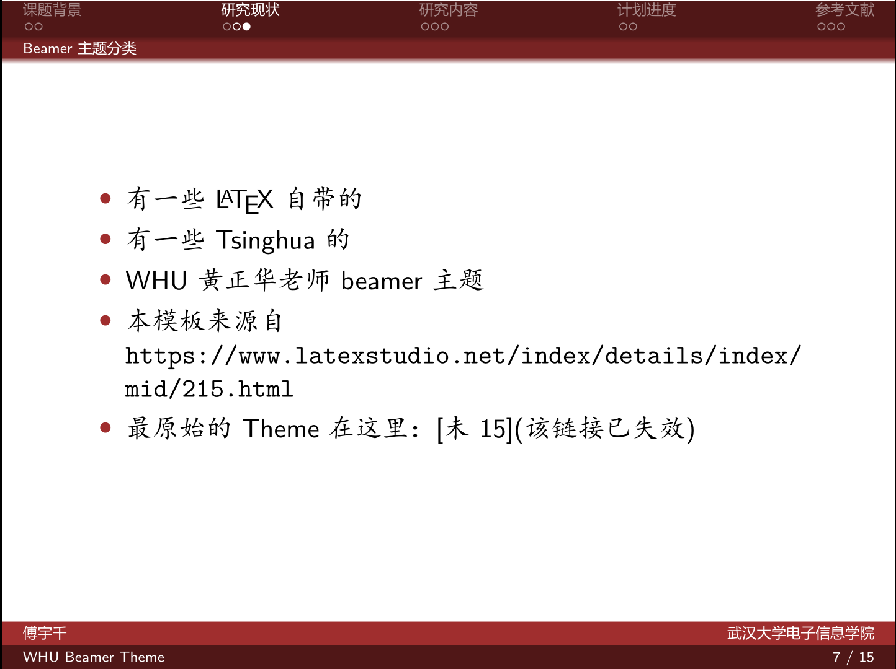

# 武汉大学 Beamer Theme(非官方)
该项目目前有 2 个主题的beamer，分别在 1、2 文件夹中。

## 一

该Beamer Theme在[清华大学毕业开题报告 beamer 主题](https://www.latexstudio.net/index/details/index/mid/215.html)上略微修改而成，后期在使用过程中可能(鸽)会附加其他功能并保持更新。
展示如下：

## 二

该主题在[黄正华的教学信息页面](http://aff.whu.edu.cn/huangzh/)j基础上修改而成，更换了字体，配色，bar的类型等，可供选择

展示如下：

